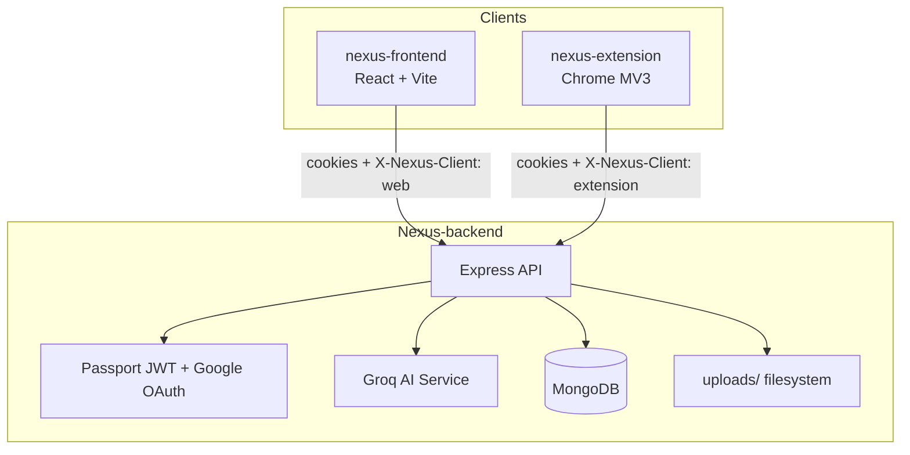

# Nexus - Final Project Analysis

*Last updated: June 2026 — reflects the full monorepo as implemented.*

## 1. Project Overview

Nexus is a full-stack second-brain platform designed to help users capture, organize, and revisit important information from the web, personal notes, and uploaded files. It combines social content saving, private note-taking, document management, AI-assisted search insights, and browser-based quick capture into one workspace.

The goal is to reduce information fragmentation. Instead of saving links in one place, writing notes in another app, and keeping documents in downloads or separate folders, Nexus provides a single structured system where everything can be searched, pinned, tagged, edited, and shared.

## 2. Core Purpose

The project solves a common productivity problem: users save useful content but lose track of it later. Nexus addresses that by offering:

- A centralized **Brain** dashboard for saved online content
- A dedicated **Notes** section for short-form knowledge and ideas
- A dedicated **Documents** section for uploaded PDF and Word files
- A public **share flow** for Brain content via hash links
- **AI explain** summaries triggered from Brain search queries
- A **Chrome extension** for fast saving directly from the browser

This makes Nexus suitable for personal knowledge management, exam preparation, research organization, and content curation.

## 3. Repository Structure

```
Week-15-Project/
├── Nexus-backend/          # Express + TypeScript API
│   └── src/
│       ├── config/         # Passport, nodemailer (stub)
│       ├── controllers/    # auth, notes, documents, oauth
│       ├── middlewares/    # errorHandler, refreshMiddleware
│       ├── routes/         # auth, oauth, notes, documents, ai
│       ├── schema/         # Zod validation schemas
│       ├── services/       # aiExplainService (Groq)
│       ├── utils/          # asyncWrap, fileUpload, appError
│       └── db.ts           # Mongoose models
├── nexus-frontend/         # React + Vite + TypeScript SPA
│   └── src/
│       ├── api/            # Axios instance + interceptors
│       ├── components/     # shadcn/ui primitives
│       ├── components_Custom/  # App-specific UI
│       ├── hooks/          # useContent, useNotes, useDocuments
│       ├── pages/          # Dashboard, Notes, Documents, etc.
│       ├── routes/         # React Router config
│       └── store/          # Zustand + TanStack Query user hooks
└── nexus-extension/        # Chrome MV3 popup quick-save
```

## 4. High-Level Architecture



### Backend

- **Runtime:** Node.js, Express 5, TypeScript
- **Database:** MongoDB via Mongoose 8
- **Auth:** Passport.js — JWT access/refresh strategies + Google OAuth 2.0
- **Validation:** Zod schemas in `schema/`
- **File uploads:** Multer (PDF, DOC, DOCX; 50 MB max)
- **AI:** Groq API via OpenAI-compatible client (`aiExplainService.ts`)
- **Structure:** Route → controller → model pattern (refactored from inline handlers)

### Frontend

- **Framework:** React 19, TypeScript, Vite 7
- **Routing:** React Router 7 (`createBrowserRouter`)
- **Styling:** Tailwind CSS 4, shadcn/ui (Radix primitives)
- **HTTP:** Axios with `withCredentials: true` and 401 interceptor
- **State:** TanStack Query for server/user data; Zustand for user preferences; custom hooks for Brain/Notes/Documents
- **Notifications:** Sonner toasts
- **Forms:** React Hook Form + Zod resolvers (auth flows)

### Chrome Extension

- **Manifest:** V3 (`nexus-extension/`)
- **Permissions:** `activeTab`, `tabs`, `storage`
- **Flow:** Reads active tab URL → auto-detects content type → `POST /auth/content` with session cookies

## 5. Major Product Areas

### 5.1 Brain (Dashboard)

The Brain section is the main content collection area for social and web links. Users can save content from YouTube, Twitter/X, Instagram, Facebook, and other URLs.

**Features:**

| Feature | Implementation |
| --- | --- |
| Add content | `ContentModal` → `POST /auth/content` |
| View cards | `Cards.tsx` with platform-specific embeds (YouTube iframe, Instagram embed, etc.) |
| Filter by type | Sidebar filters on Dashboard (`all`, `twitter`, `youtube`, `instagram`, `facebook`) |
| Search | Client-side filter by title and tags |
| AI explain | Debounced `POST /ai/explain` when search query ≥ 2 chars |
| Delete | Alert dialog → `DELETE /auth/content` |
| Share item | Web Share API or clipboard fallback per card |
| Share Brain | `POST /auth/brain/share` → copies `/share/:hash` URL |
| URL preview | `GET /auth/preview?url=...` (Open Graph meta scraping) |

Brain content is the **only** section with a public share model.

### 5.2 Notes

Private workspace for user-written notes, separate from Brain content.

**Features:**

- Create, edit, delete notes
- Pin/unpin (sorted: pinned first, then by `updatedAt`)
- Color coding (6 Tailwind background options)
- Tag management (shared `Tag` model with Brain/Documents)
- Search via `GET /notes/search/query?q=...`

**UI:** `NotesPage`, `NoteCard`, `NoteModal`, `useNotes` hook.

### 5.3 Documents

Private area for file uploads and metadata management.

**Features:**

- Upload PDF, DOC, DOCX (Multer, 50 MB)
- Edit title, description, tags (metadata only on update)
- Pin/unpin, delete (removes DB record and filesystem file)
- Search via `GET /documents/search/query?q=...`
- Files served at `/uploads/:filename`

**UI:** `DocumentsPage`, `DocumentCard`, `DocumentModal`, `useDocuments` hook.

### 5.4 AI Explain (Search Insights)

When a user types a search query of 2+ characters on the Brain dashboard, Nexus requests an AI explanation alongside filtered card results.

**Backend (`POST /ai/explain`):**

- Protected by JWT
- Validates query (2–120 chars)
- Calls Groq (`llama-3.3-70b-versatile` by default) via OpenAI-compatible API
- Returns structured JSON: `summary`, `keyPoints`, `relatedTopics`, `disclaimer`
- Server-side in-memory cache (15-minute TTL per normalized query)

**Frontend (`Dashboard.tsx`):**

- 600 ms debounce before API call
- Client-side cache keyed by lowercase query
- Renders summary panel with clickable related-topic chips
- Graceful degradation if AI is unavailable

### 5.5 Chrome Extension

Quick-save popup without leaving the current tab.

**Behavior:**

1. Reads active tab URL on popup open
2. Auto-detects content type from hostname (`youtube`, `twitter`, `instagram`, `facebook`, `other`)
3. User can edit title, link, tags (comma-separated)
4. Saves via `POST /auth/content` with `credentials: "include"`
5. Requires user to be logged in to Nexus in the same browser
6. "Open Nexus" button navigates to `/app/dashboard`

**Client identification:** Requests must include `X-Nexus-Client: extension` or `X-Nexus-Client: web` — otherwise `POST /auth/content` returns 403.

### 5.6 Public Shared Brain

- Route: `/share/:shareLink` (frontend) → `GET /auth/brain/:shareLink` (backend)
- Resolves hash from `Link` model → returns username + all Brain content for that user
- Read-only public view using the same `Card` component

## 6. User Experience Flow

1. User visits landing page (`/`) or goes directly to `/auth/login`.
2. User signs in with email/password or Google OAuth.
3. OAuth callback sets httpOnly cookies and redirects to `/app/dashboard`.
4. Saved social content appears as cards in the Brain section.
5. User opens **Notes** or **Documents** from the sidebar.
6. Search, pinning, and type filters help surface important items.
7. Brain search triggers AI summaries for exploratory queries.
8. User generates a Brain share link when public access is needed.
9. Chrome extension can save tabs anytime without opening the full app.

## 7. Backend Implementation Details

### 7.1 Authentication

| Mechanism | Details |
| --- | --- |
| Local auth | bcrypt password hashing; signup creates `authProvider: "local"` user |
| Google OAuth | Separate `oauthRoutes`; `findOrCreate`-style logic in Passport Google strategy |
| JWT cookies | `accessToken` + `refreshToken` in httpOnly cookies (`sameSite: lax`) |
| Token extraction | Cookies first, then `Authorization: Bearer` header |
| Access token TTL | 24h on login; 1h on refresh endpoint |
| Refresh token TTL | 7d on login; 15d on Google OAuth callback |
| Logout | Clears both cookies |
| Email conflict | Google login blocked if email exists as local account → redirect with `?error=email_exists` |

**Controllers:** `authController.ts` (signup, login, refresh, user, logout, content, share, preview), `oauthController.ts` (Google callback).

**Refresh flow:** `GET /auth/refresh` uses `refreshMiddleware` (validates refresh-token cookie via Passport `jwt-refresh` strategy) before `authController.refresh` issues a new access token. The frontend Axios interceptor retries failed requests once after calling `/auth/refresh` on 401.

### 7.2 Data Validation (Zod)

| Schema file | Covers |
| --- | --- |
| `authSchema.ts` | Signup, login |
| `notesSchema.ts` | Create/update note |
| `docsSchema.ts` | Create/update document metadata |
| `aiRoutes.ts` (inline) | AI explain query |

### 7.3 Database Models (`db.ts`)

| Model | Key fields |
| --- | --- |
| **User** | `userName`, `email`, `authProvider`, `password?`, `googleId?`, `profilePictureUrl?` |
| **Content** | `title`, `link`, `type`, `tags[]`, `userId` |
| **Note** | `title`, `content`, `tags[]`, `color`, `isPinned`, `userId` |
| **Document** | `title`, `filename`, `originalName`, `mimetype`, `size`, `description`, `tags[]`, `isPinned`, `userId` |
| **Tag** | `title` (unique, shared across Content/Notes/Documents) |
| **Link** | `hash`, `userId` (one share link per user) |

### 7.4 File Uploads

- Storage: `Nexus-backend/uploads/` (auto-created)
- Naming: `{timestamp}-{random}{ext}`
- Allowed MIME types: `application/pdf`, `application/msword`, DOCX MIME
- Max size: 50 MB
- Static serving: `app.use("/uploads", express.static(...))`

### 7.5 Error Handling

Central `errorHandler` middleware handles:

- Mongoose validation errors → 400
- Duplicate key (11000) → 409
- Cast errors → 400
- Unhandled errors → 500

Controllers use `asyncWrap` to forward async errors to the handler.

### 7.6 CORS

Allowed origins:

- `FRONTEND_URI`
- `EXTENSION_ORIGIN` (optional, for strict production matching)
- Any `chrome-extension://` origin (development convenience)

`credentials: true` for cookie-based auth.

## 8. Frontend Implementation Details

### 8.1 Routing

| Path | Page | Auth |
| --- | --- | --- |
| `/` | `LandingPage` | Public |
| `/auth/login` | `LoginPage` | Public |
| `/auth/signup` | `SignupPage` | Public |
| `/app/dashboard` | `Dashboard` (Brain) | Cookie session |
| `/app/notes` | `NotesPage` | Cookie session |
| `/app/documents` | `DocumentsPage` | Cookie session |
| `/share/:shareLink` | `SharedBrain` | Public |

Global error boundary (`GlobalErrorBoundary`) and Sonner toaster wrap the app.

### 8.2 UI Structure

- **Sidebar:** `AppSidebar` — main nav (Brain, Notes, Documents) + Brain type filters
- **Layout:** Sticky mobile header with hamburger menu; fixed sidebar on desktop (`lg:ml-64`)
- **Cards:** Platform-aware previews (YouTube embed, Instagram embed, link cards)
- **Modals:** `ContentModal`, `NoteModal`, `DocumentModal` (shadcn Dialog)
- **Search:** Shared `SearchBar` component across pages

### 8.3 State and Data Flow

| Hook / Store | Responsibility |
| --- | --- |
| `useContent` | Fetch/create/delete Brain content |
| `useNotes` | CRUD, pin, search notes |
| `useDocuments` | Upload, update, delete, pin, search documents |
| `useUserQuery` / `useUser` | TanStack Query for current user |
| `useUserStore` | Zustand for user preferences |

Axios interceptor on 401: attempts `GET /auth/refresh` and retries the original request; if refresh fails, logs out and shows a session-expired toast.

### 8.4 UX Features

- Loading states on Notes/Documents pages
- Toast notifications (success/error)
- Empty states with contextual messages
- Responsive grid layouts (1 → 4 columns)
- Mobile sidebar overlay
- Delete confirmation dialogs (AlertDialog)
- AI search panel with related-topic chips

## 9. API Summary

### Auth (`/auth`)

| Method | Route | Auth | Description |
| --- | --- | --- | --- |
| POST | `/auth/signup` | No | Create local account |
| POST | `/auth/login` | No | Login, set JWT cookies |
| GET | `/auth/refresh` | Refresh token | Issue new access token |
| GET | `/auth/user` | JWT | Current user profile |
| POST | `/auth/logout` | No | Clear cookies |
| GET | `/auth/google` | No | Start Google OAuth |
| GET | `/auth/google/callback` | No | OAuth callback, set cookies |
| POST | `/auth/content` | JWT | Add Brain content |
| GET | `/auth/content` | JWT | List user's Brain content |
| DELETE | `/auth/content` | JWT | Delete content by `contentId` |
| POST | `/auth/brain/share` | JWT | Enable/disable share hash |
| GET | `/auth/brain/:shareLink` | No | Public shared Brain |
| GET | `/auth/preview?url=` | No | URL Open Graph preview |

### Notes (`/notes`)

| Method | Route | Auth |
| --- | --- | --- |
| POST | `/notes` | JWT |
| GET | `/notes` | JWT |
| GET | `/notes/:noteId` | JWT |
| PUT | `/notes/:noteId` | JWT |
| DELETE | `/notes/:noteId` | JWT |
| PATCH | `/notes/:noteId/toggle-pin` | JWT |
| GET | `/notes/search/query?q=` | JWT |

### Documents (`/documents`)

| Method | Route | Auth |
| --- | --- | --- |
| POST | `/documents` | JWT (multipart) |
| GET | `/documents` | JWT |
| GET | `/documents/:documentId` | JWT |
| PUT | `/documents/:documentId` | JWT |
| DELETE | `/documents/:documentId` | JWT |
| PATCH | `/documents/:documentId/toggle-pin` | JWT |
| GET | `/documents/search/query?q=` | JWT |

### AI (`/ai`)

| Method | Route | Auth | Description |
| --- | --- | --- | --- |
| POST | `/ai/explain` | JWT | AI summary for search query |

## 10. Security Considerations

| Measure | Details |
| --- | --- |
| JWT auth | Protected routes use `passport.authenticate("jwt-access")` |
| httpOnly cookies | Tokens not accessible to JavaScript |
| User isolation | All queries scoped by `userId` from `req.user` |
| Client header check | Brain content creation requires `X-Nexus-Client` |
| Input validation | Zod on auth, notes, documents, AI routes |
| File restrictions | MIME type + size limits on uploads |
| CORS | Whitelist + extension origins; credentials enabled |
| Password handling | bcrypt with cost factor 10 |
| Production cookies | `secure: true` when `NODE_ENV=production` |

## 11. Environment Variables

### Backend (`Nexus-backend/.env`)

**Required (validated at startup):**

| Variable | Purpose |
| --- | --- |
| `MONGO_URI` | MongoDB connection string |
| `PORT` | Server port (default 3000) |
| `SESSION_SECRET` | Express session signing |
| `ACCESS_KEY` | JWT access token secret |
| `REFRESH_KEY` | JWT refresh token secret |
| `GOOGLE_CLIENT_ID` | Google OAuth |
| `GOOGLE_CLIENT_SECRET` | Google OAuth |
| `GOOGLE_REDIRECT_URI` | OAuth callback URL |
| `FRONTEND_URI` | CORS + OAuth redirects |

**Optional / feature-specific:**

| Variable | Purpose |
| --- | --- |
| `GROQ_API_KEY` | AI explain feature (required for AI to work) |
| `GROQ_MODEL` | Groq model override (default: `llama-3.3-70b-versatile`) |
| `EXTENSION_ORIGIN` | Strict extension CORS in production |
| `NODE_ENV` | `production` enables secure cookies |
| `UI_URL` | Legacy fallback in one auth branch |
| `SENDER_EMAIL_ADDRESS` | Nodemailer (not wired in current flow) |
| `GOOGLE_REFRESH_TOKEN` | Nodemailer (not wired in current flow) |

> **Note:** `.env.example` still lists `GEMINI_API_KEY` / `GEMINI_MODEL`, but the implemented AI service uses **Groq** (`GROQ_API_KEY`, `GROQ_MODEL`). Update your `.env` accordingly.

### Frontend (`nexus-frontend/.env`)

| Variable | Purpose |
| --- | --- |
| `VITE_SERVER_URL` | Backend API base URL (e.g. `http://localhost:3000`) |
| `VITE_APP_URL` | Frontend URL for share links (e.g. `http://localhost:5173`) |

## 12. Setup Summary

### Prerequisites

- Node.js 18+
- npm
- MongoDB (local or Atlas)
- Groq API key (optional, for AI explain)

### Backend

```bash
cd Nexus-backend
npm install
# Create .env from .env.example (use GROQ_API_KEY for AI)
npm run dev
```

`npm run dev` compiles TypeScript then starts `dist/index.js`.

### Frontend

```bash
cd nexus-frontend
npm install
# Set VITE_SERVER_URL and VITE_APP_URL in .env
npm run dev
```

Useful scripts: `npm run build`, `npm run lint`, `npm run preview`.

### Chrome Extension

1. Open `chrome://extensions`
2. Enable **Developer mode**
3. Click **Load unpacked**
4. Select the `nexus-extension` folder
5. Log in to Nexus in the browser before saving from the extension

## 13. Current Product Scope

| Area | Visibility | Shareable |
| --- | --- | --- |
| Brain | Authenticated | Yes — public hash link |
| Notes | Authenticated, private | No |
| Documents | Authenticated, private | No |
| AI Explain | Authenticated (Brain search) | No |

## 14. Known Gaps and Technical Notes

These are implementation details worth knowing for maintenance or future work:

1. **`.env.example` vs AI service** — example file references Gemini; runtime code uses Groq.
2. **`aiRoutes` error check** — checks for `GEMINI_API_KEY` in error message but service throws `GROQ_API_KEY` errors.
3. **Extension title field** — `getCurrentTabData()` returns empty title; user must fill title manually unless improved.
4. **Nodemailer config** — `config/nodeMailer.ts` present but welcome-email flow not integrated.
5. **Share brain response shape** — new share returns `{ message: "/share/hash" }` but Dashboard expects `response.data.hash`; re-share of existing link returns `{ hash }` correctly.

## 15. Tech Stack Reference

| Layer | Technologies |
| --- | --- |
| Frontend | React 19, Vite 7, TypeScript 5.8, Tailwind 4, shadcn/ui, TanStack Query 5, Zustand 5, React Router 7, Axios, Sonner, React Hook Form, Zod, Lucide icons |
| Backend | Node.js, Express 5, TypeScript 5.8, Mongoose 8, Passport (JWT + Google), Zod 4, Multer, bcrypt, jsonwebtoken, OpenAI SDK (Groq-compatible) |
| Extension | Chrome Manifest V3, vanilla HTML/CSS/JS |
| Database | MongoDB |
| AI | Groq API (`llama-3.3-70b-versatile`) |

## 16. Final Summary

Nexus is a well-structured second-brain platform that brings together content saving, notes, documents, AI-assisted search, and browser quick capture into one application. The architecture cleanly separates responsibilities across backend controllers, frontend hooks/pages, and the extension layer while keeping user workflows simple and focused.

The backend follows a maintainable route → controller → model pattern with Zod validation and centralized error handling. The frontend uses modern React patterns (TanStack Query, shadcn/ui, responsive layouts) with three distinct workspaces unified by a shared sidebar. The Chrome extension closes the capture loop for frictionless Brain saves.

Together, these pieces demonstrate practical full-stack features: dual auth strategies, file upload handling, public share links, tag normalization, search, AI integration with caching, and responsive UI — making Nexus a strong example of a real-world productivity system.
